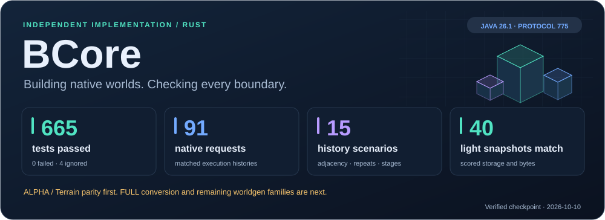
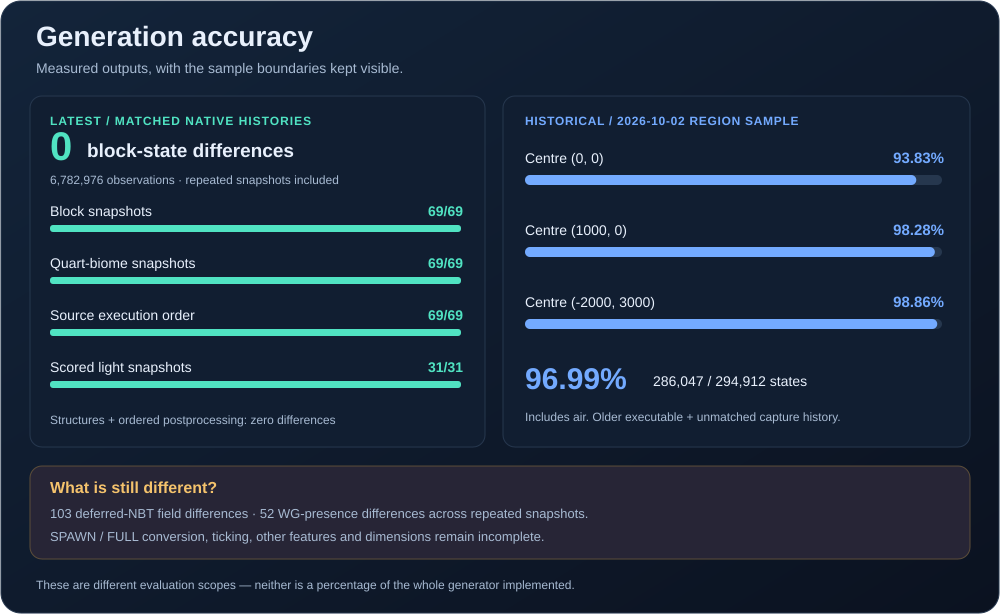
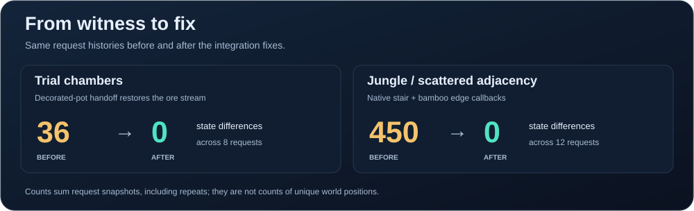
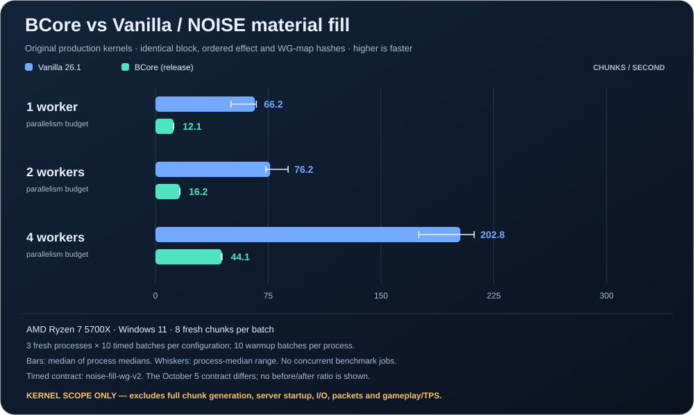
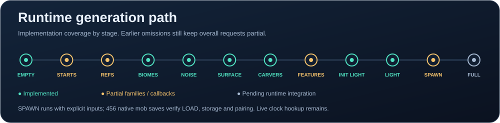

# BCore

<p align="center">
  
</p>

<p align="center">
  <a href="https://github.com/HVHBIGNAME/BCore/actions/workflows/ci.yml"></a>
  <a href="https://HVHBIGNAME.github.io/BCore/"></a>
  <a href="docs/parity-report.md"></a>
  <a href="LICENSE"></a>
</p>

A native [Minecraft: Java Edition](https://www.minecraft.net) server written in Rust. Development and vanilla comparisons currently use **26.1 / protocol 775**; migration to **26.2 / 776** follows parity work. [SteelMC](https://github.com/Steel-Foundation/SteelMC) is the primary implementation reference.

BCore is an **independent implementation** (not a fork) aiming for vanilla parity while making better use of modern multi-core hardware — plus a native plugin system and a Bukkit/Spigot/Paper plugin bridge.

> **Status: alpha, vanilla parity incomplete.** Offline login, chunk streaming, chat, commands and persistence are implemented. Worldgen is the current priority. See the [implementation tracker](https://HVHBIGNAME.github.io/BCore/) and [measured parity report](docs/parity-report.md).

<p align="center">
  <a href="#generation-accuracy">Accuracy</a> ·
  <a href="#performance-comparison">Performance</a> ·
  <a href="#current-work">Progress</a> ·
  <a href="#building">Run BCore</a> ·
  <a href="docs/metrics/README.md">Measurement data</a>
</p>

## Generation accuracy



**Latest checkpoint:** 69 requests across 11 matching native execution histories,
with **0 block-state, biome, source-order or scored-light differences**. That is
6,782,976 block-state observations, including air and repeated snapshots.

The older three-region comparison remains **286,047 / 294,912 states (96.99%)**,
768/768 terrain heights and 4,608/4,608 biome cells. It uses an older executable
and a different capture history. **Neither result means 100% worldgen completion.**
Deferred block-entity materialization, FULL conversion and other omissions are
tracked in the [detailed report](docs/parity-report.md).

### Concrete fixes



- **Trial chambers:** native decorated-pot NBT handoff now lets the neighbouring
  andesite stream finish. All nine before/after dependency chunks and RNG
  continuation witnesses match the native capture.
- **Jungle adjacency:** 10,212 native stair updates and 9,360 bamboo updates verify
  live neighbour reads, shape changes and scheduled-tick order.

## Performance comparison



This compares the **terrain material-fill kernel** in BCore and the original
Vanilla 26.1 JAR on the same machine, seed, eight chunks and worker budgets.
It includes aquifers and noise ore veins; it excludes server startup, later
generation stages, storage, packets and gameplay. It is **not a full-server TPS
ranking**. Bars show medians; whiskers show variation between fresh processes.

At four workers this local test measures **5.83 chunks/s for BCore** and
**168.49 chunks/s for Vanilla**. Improving the current BCore fill kernel remains
performance work ahead.

[Exact timings, hardware and reproduction commands](docs/performance.md) ·
[Raw measurements and hashes](docs/metrics/noise-fill-2026-10-05.json)

## Current work



| Delivered | Current focus | Following work |
|---|---|---|
| Shared cross-chunk generation; native light storage and updates | Connect all 19 tested overworld CREATURE finalizers to runtime SPAWN | FULL conversion, deferred NBT and tick lifecycle |
| Villages, ancient cities, trail ruins, trial chambers, treasure, huts and jungle pyramids | Preserve mob identity/data through storage and network delivery | Remaining structure families, saved-holder hydration, Nether/End |
| Typed block-entity NBT, ordered effects and `.bcc` persistence | Extend matched-history integration checks | Broader performance work after correctness checks |

Project updates and evidence are published together in the
[tracker](https://HVHBIGNAME.github.io/BCore/), [parity report](docs/parity-report.md)
and [roadmap](docs/roadmap.md).

## Highlights

- Native Rust, multi-crate workspace (bounded contexts).
- Protocol 775: handshake, status, offline login, configuration and play.
- Native plugin system: trait-based `Plugin`, thread-safe `PluginManager`, events, dynamic `.dll`/`.so` loading.
- Data-driven seed-based Overworld generation with bundled assets and offline vanilla-reference tests. Trees, caves, ores and structures are not yet block-for-block compatible.
- Shared, status-aware generation across chunk requests, with explicit source coverage and persisted generated block-entity data, ticks and postprocessing marks.
- JVM virtualization bridge for Bukkit/Spigot/Paper plugins (ADR-0001) — loads an original `.jar` and invokes `onEnable`.

## Crates

| Crate | Purpose |
|---|---|
| `bcore` | Server binary |
| `bcore-core` | Shared types, version constants, protocol primitives |
| `bcore-protocol` | Protocol 775: login/play, commands, streaming and persistence |
| `bcore-plugin` | Native plugin API and manager |
| `bcore-plugin-java` | JVM bridge for legacy Java plugins |
| `bcore-worldgen` | Deterministic seed-based generation |
| `bcore-registry` | Data-driven block/item registry (future) |

## Building

```bash
cargo build --workspace
cargo test --workspace --release --locked --no-fail-fast -j 1 -- --test-threads=2
```

Run the server:

```bash
cargo run -p bcore -- --host 0.0.0.0 --port 25565
```

Use a 26.1 client for the current development protocol. Generated chunks are saved
under `world/`; existing saves preserve the output of the generator that created
them. The worldgen data ships inside the executable. `BCORE_DATAPACK` optionally
selects an external extracted datapack for development.

### Generate with explicit coverage

The worldgen API retains neighbouring work across requests and reports missing
stages alongside the generated chunk:

```rust
use bcore_core::ChunkPos;
use bcore_worldgen::{generation::ChunkStatus, GenerationWorld};

let world = GenerationWorld::new(846692123413862008);
let result = world.generate_to_status(ChunkPos::new(14, 8), ChunkStatus::Light)?;

println!("Block states: {}", result.chunk.states().len());
println!("Complete native coverage: {}", result.coverage.is_complete());
for missing in &result.coverage.missing_stages {
    println!("{}: {}", missing.status, missing.reason);
}
```

Charts are committed SVGs generated from versioned evidence. To check them:

```bash
python scripts/render_readme.py --check
```

## Documentation

- [Implementation tracker](https://HVHBIGNAME.github.io/BCore/)
- [Measured parity report](docs/parity-report.md)
- [Performance comparison and methodology](docs/performance.md)
- [Published measurement data](docs/metrics/README.md)
- [Worldgen parity plan](docs/worldgen-parity-plan.md)
- [Native feature scheduling](docs/feature-scheduling.md)
- [Generated tree effects, persistence and tick preparation](docs/tree-effects.md)
- [Architecture](docs/architecture.md)
- [Reference projects](docs/references.md)
- [Paper/Purpur patch strategy](docs/paper-purpur-patches.md)
- [ADR-0001: plugin translation strategy](docs/adr/0001-plugin-translation-strategy.md)

## License

MIT — see [LICENSE](LICENSE).
